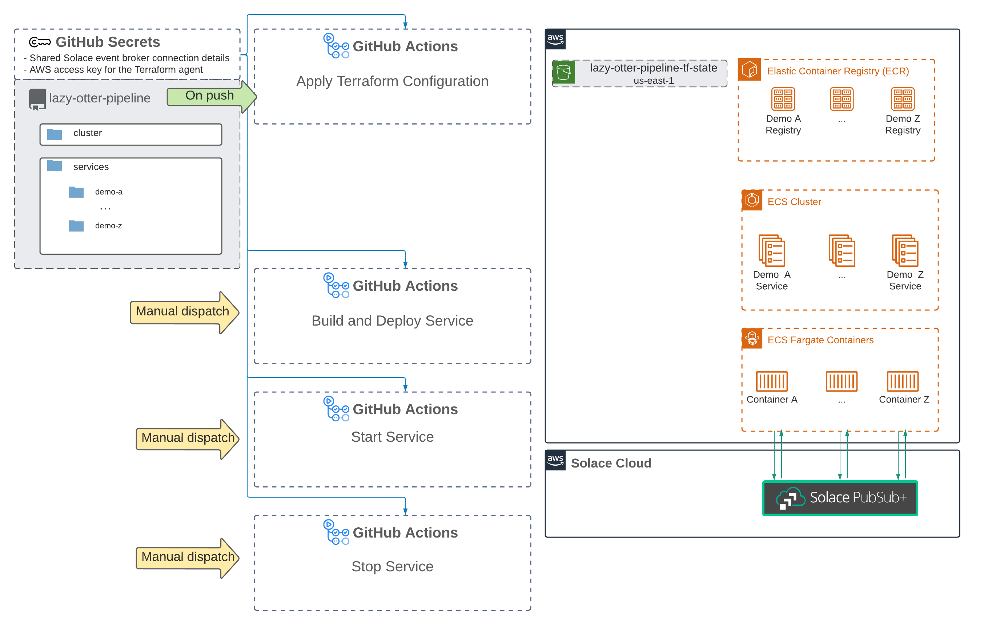

This repo contains the source code for a CI/CD pipeline that helps you run containerized apps in AWS. To use this pipeline you'll need to set up a repo in your GitHub organization with your own secrets. The documentation and available services—both the list and all the directories in [terraform/modules/services](terraform/modules/services) except for [_template](terraform/modules/services/_template)—are just examples and should be deleted once you set up your 
# Table of contents

- [Available services](#available-services)
- [Features](#features)
- [Architecture diagram](#architecture-diagram)
- [Directory structure](#directory-structure)
- [Environment variables](#environment-variables)
- [Secrets](#secrets)
- [Shared PubSub+ Cloud: Event Broker](#shared-pubsub-cloud-event-broker)
- [Steps to onboard a service](#steps-to-onboard-a-service)
- [Steps to deploy a service](#steps-to-deploy-a-service)
- [Steps to stop a service](#steps-to-stop-a-service)
- [Steps to start a service](#steps-to-start-a-service)
- [Steps to check a service's logs](#steps-to-check-a-services-logs)
- [Steps to remove a service](#steps-to-remove-a-service)

# Available services

| Name                       | Root topic                  | Repository                                                     |
| -------------------------- | --------------------------- | -------------------------------------------------------------- |
| faa-scds-feeds-simulator   | fdps-simulator/             | [link](https://github.com/solacese/faa-scds-feeds-simulator)   |
| package-scan-simulator     | package.delivery/scanned/   | [link](https://github.com/solacese/package-scan-simulator)     |
| ecommerce-order-simulator  | ecommerce-order-simulator/  | [link](https://github.com/solacese/ecommerce-order-simulator)  |
| cdc-order-source           | cdc-order-source/           | [link](https://github.com/solacese/cdc-order-source)           |
| order-validation-processor | order-validation-processor/ | [link](https://github.com/solacese/order-validation-processor) |

# Features

- Push button service deployment, scaling, and starting/stopping
- Shared access to a dedicated event broker service
- CloudWatch Logs
- Optional CloudWatch Alarms

# Architecture diagram

# Directory structure

| Name                | Description                                                                                                                    |
| ------------------- | ------------------------------------------------------------------------------------------------------------------------------ |
| .github             | Workflow configuration files for GitHub Actions.                                                                               |
| dockerfile-examples | Example Dockerfiles that show how to build images for a few different application languages.                                   |
| terraform           | Terraform configuration files for the cluster and all active services. On-boarding a service includes adding a directory here. |

# Environment variables

The following environment variables are set for all containers:

- `SOLACE_USERNAME`
- `SOLACE_PASSWORD`
- `SOLACE_MESSAGE_VPN`
- `SOLACE_HOST_AMQP`
- `SOLACE_HOST_MQTT`
- `SOLACE_HOST_MQTT_WSS`
- `SOLACE_HOST_REST`
- `SOLACE_HOST_SMF`
- `SOLACE_HOST_WSS`

# Secrets

All of the above environment variables are set as GitHub Secrets on this repository (Settings -> Secrets), as well as the following:

- `AWS_ACCESS_KEY_ID_TF_AGENT` - permissioned so the TF agent can create resources
- `AWS_SECRET_ACCESS_KEY_TF_AGENT`

# Shared PubSub+ Cloud: Event Broker

There is a dedicated event broke service that any services deployed by this pipeline can connect to by using the environment variables listed above.

**Name:** demos-infra  
**Region:** us-east-1b  
**Console link:** [ REDACTED ]

# Steps to onboard a service

Follow the instructions outlined [here](/terraform/modules/services/_template/README.md)

# Steps to deploy a service

# Steps to stop a service

# Steps to start a service

# Steps to check a service's logs

# Steps to remove a service

1. Clone this repository and make a new branch
2. Delete the service's directory under [terraform/modules/services](/terraform/modules/services)
3. Remove the corresponding module block in [terraform/modules/services/main.tf](/terraform/modules/services/main.tf)
4. Make a PR

Terraform diffs the existing state of the deployment with any changes you make to the configuration files, so it will know what to delete.
