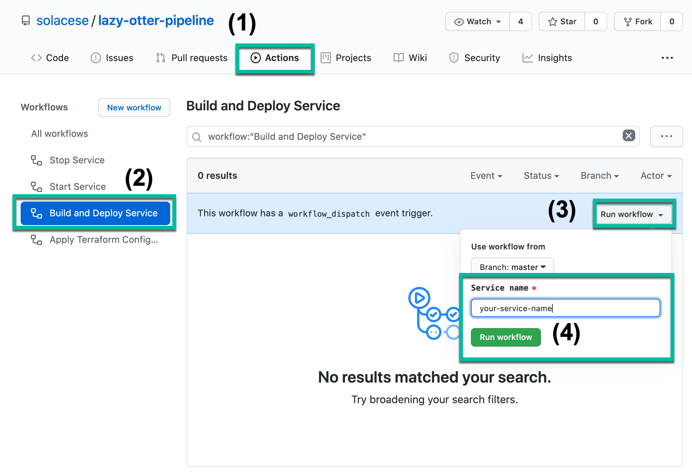
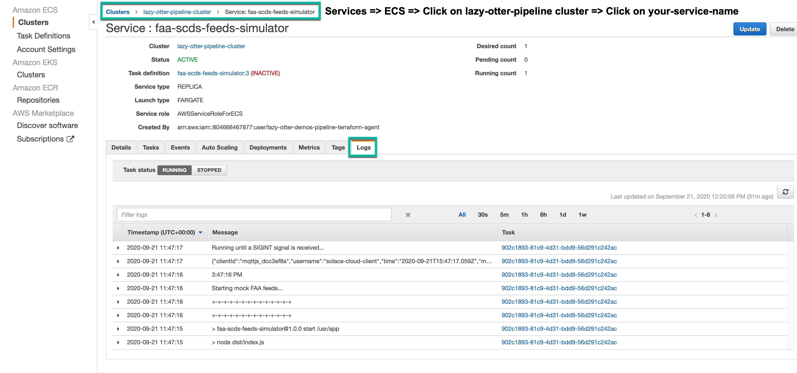

# Service template

## Table of contents

- [Steps to onboard a new service](#steps-to-onboard-a-new-service)
- [Default IAM permissions](#default-iam-permissions)

## Steps to onboard a new service

### 1. Clone this repository and make a new branch for the new service you want to onboard.

```
git clone git@github.com:solacese/lazy-otter-pipeline.git
cd lazy-otter-pipeline
git checkout -b service-name
```

### 2. Duplicate `terraform/modules/services/_template` and name it to match the services's parent repository name.


### 3. Edit the new service's `variables.tf` configuration file


### 4. Add a module block for the new service in [terraform/modules/services/main.tf](/terraform/modules/services/main.tf).


### 5. Update the main README's "Active services" table to include the new service.


### 6. Make a PR and double-check your work with the included checklist.


### 7. After the PR is merged, run the "Build and Deploy Service" GitHub Action.



note: don't worry about affecting other services, the workflow only builds and deploys the service you specify

### 8. Lastly, check your service's logs to make sure it started correctly.



---

## Default IAM permissions

```
{
    "Version": "2012-10-17",
    "Statement": [
      {
        "Effect": "Allow",
        "Action": [
          "dynamodb:*",
          "kinesis:*",
          "lambda:*",
          "polly:*",
          "rds:*",
          "rekognition:*",
          "s3:*",
          "sns:*",
          "sqs:*",
          "textract:*",
          "transcribe:*",
          "translate:*"
        ],
        "Resource":"*"
      }
    ]
  }
```

If you need access to a service that isn't listed in the above policy statement, feel free to edit it and make a PR.  
You can also edit your service's `main.yml` to provision an IAM role specifically for your service.
